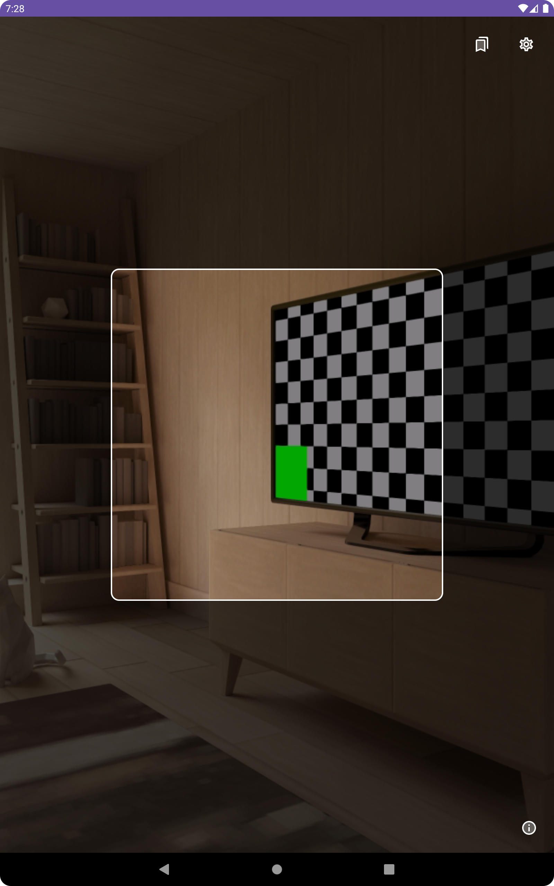

# JSCJ QR Code Scanner + HTTP Client

![[Cropped] - JSCJ_QR_Code_Logo.png](README/Cropped_-_JSCJ_QR_Code_Logo.png)

This is a QR code scanner that I made for a Sunday School that I volunteer at. We ran into a technical problem where we needed to take data from QR codes, and send HTTP requests using the data that was scanned. There wasn’t a reliable solution on the Google Playstore that matched our needs, so I took the initiative to make a custom application that takes care of this exact purpose.

# Requirements

- Android 10+
- Camera Permissions

# Hiring

If you or your company is hiring Software Engineers or roles of a similar nature, please feel free to reach out to me at [hasnaincodes@gmail.com](mailto:hasnaincodes@gmail.com) and I will send you a resume as soon as I can!

# Download

Please find the latest download in the releases section on GitHub linked [here](https://github.com/hasnain1230/JSCJ-QRCode-Scanner/releases). A Playstore download will be coming soon!

# Introduction

This application allows the user to simply scan QR codes as they wish and see the data embedded in the QR code (Read Mode), or they can use HTTP Mode and use the data that was scanned and send that data in an HTTP request that the user can build. Users can also save configurations, delete configurations, and load prior configurations. Users can also save various links for quick access per configuration if they so choose. Other QOL (Quality of Life) features are also implemented like tap to auto focus, flash toggle, success and failure sounds, etc.

## Features

- QR Code Reading
- Using QR Code data to send HTTP requests to specified endpoint
- Saving and reloading HTTP request configurations
- Saving links in a link library and opening them in the default Android web browser.
- Reloading saved links when resetting configurations
- Flash toggle
- Tap to auto focus (TTAF) with animations
- Distinctive success and error sounds upon scanning in HTTP mode
- QR code recognition using GoogleML Kit

## Technologies

JSCJ QR Code Scanner + HTTP Client uses a variety of different technologies including:

- Google Vision ML Kit
- Zebra Crossing by Journey Apps
- Google GSON
- Kotlin (Jetpack Compose)
- OkHttp
- CameraX

# How To Use

This application is very simple to use. Opening up the application, you will see a camera preview of the application. This application is purposefully designed to only use the rear camera. Therefore, if there is a QR code on your face that you want to scan, I am afraid you are tough out of luck. If rear camera permission is a requested feature, I will add it, but I don’t think it it necessary.

## The Camera Preview

- Camera Preview When Opening The Application



You may notice in the picture above there is no button for flash. Some Android devices do not have a flash button. If the application detects flash on your device, a button to toggle flash will appear in the top right. Most smartphones have flash hardware, but some tablets do lack this feature.

- If flash hardware is detected on your device, you will see a flash button in the top left of the view finder camera preview allowing you to toggle flash on and off.


*Flash Toggled Off*


*Flash Toggled On*

At this point, in the camera preview, all you need to do is align the QR code you are trying to scan with the box cutout in the middle and the QR code should scan automatically. Upon a successful scan, you should see a message that will vary depending on your settings.

- Scanning QR Code


*Note how the QR code is within the specific cutout*


*Here, you can see the result of the QR code in Read Mode*

## Saved Links

By clicking the Book Mark Menu in the Camera Preview screen, you can access a screen to save commonly accessed links you might need quick access to. This feature was built specifically for a specific custom, internal use of ours, but it is simply a basic database of user saved links.

- Adding Saved Links


*Click The Plus Icon At The Bottom Right To Save A Link*


*By clicking on the link, the link will open in the default device browser*

- Deleting Links

If you want to delete a link, you can either hold the link you want to delete and remove the link, or you can tap the pencil icon at the top right of the screen and select multiple or select all links to remove.


*Delete links by long pressing on them*


*You can also select multiple items in the list to delete, or you can select all the items to delete them by clicking the top right delete all icon*


## Configuring the QR Code Scanner

By tapping the settings icon from the camera preview view, you can access the settings screen where by you can also configure the HTTP client

- Default Settings Screen

By default, the settings menu will show “Read Mode”. If you want to change this, simply select HTTP Mode to configure the HTTP Client.


Please Note: For all requests other than GET requests, there are two Request Types available.

- Concatenate:
    - This request type will simply take the QR code data you scan, add that value from the QR code to the end of your URL, and send the HTTP request you configured.
    - **Example:
      URL: https://localhost/?var1=
      Request Type:** Concatenate

  **QR Code Data:** “Hello_World”
  **Request Sent:** https://localhost/?var1=Hello_World
- Body Request
    - For this request type, if you select “Body Request”, you will be able to select the expected format of your QR Code Data. Suppose you know you are scanning JSON encoded QR codes and you want to take that data and put it in the body of your request, you can do that in this mode:
    - **Example:
      URL: https://localhost
      Request Type:** Body Request

  **QR Code Data:**

    ```json
    {
    	"text": "Hello World"
    	"args": ["arg1", "arg2", "arg3"]
    }
    ```

  The corresponding request that will be sent is a request to the URL with an HTTP body of the specific JSON

  


*The body type expected here is JSON. That means, the specific QR code you scan is expected to be a JSON. A post request will be sent to the URL with the QR code JSON in the body of the request.*

**Note:** If you do not want to save the configuration for later use, you can simply hit back and the settings you applied here will persist while you scan QR codes until you change them again.

- Saving The Current Configuration:

To save your current configuration, hit the save button at the bottom right of the screen. There, you can name your configuration and save it.


- Loading Saved Configurations:

If you accidentally changed your settings, lost them, and want to reload a previous configuration, simply hit the “Saved Configurations” button at the top right corner. There, you will all your saved configs there and ready for use. Simply tap on your desired config and all your prior settings AND saved links at the time of your creating your configuration will be reloaded.


## Successful and Unsuccessful Scans

If your request results in an error, you will see an error message like the one below:


Likewise, a successful request will display the following:


# Conclusion

This is a QR code scanner + HTTP Client I made for an organization I volunteer at. If you have any questions, please feel free to leave a review on the Google Playstore, or make a GitHub issue and I will respond to it when I can. Likewise, if you have any feature requests, please do the same.